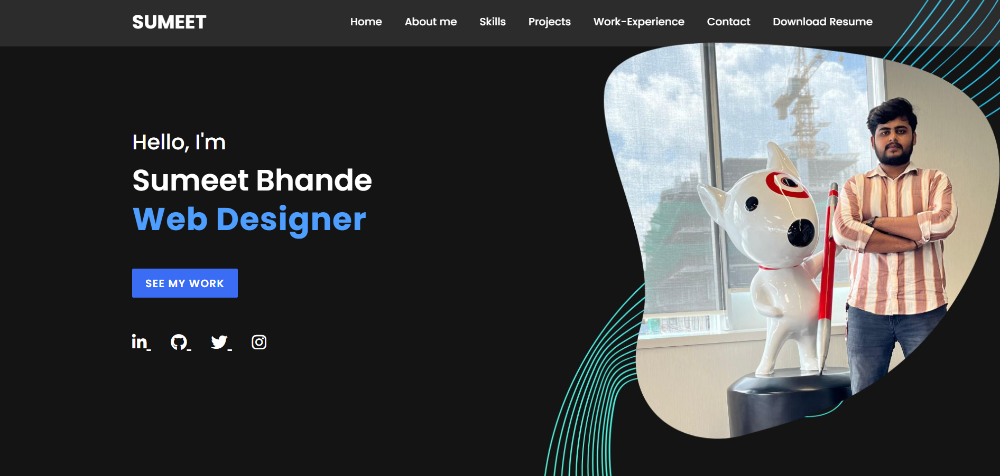

# 🌐 Responsive Portfolio Website

A **fully responsive and modern portfolio website** built using **only HTML and CSS**. This project is ideal for developers and designers looking to showcase their work, skills, and experience in a sleek, professional manner.

## ✨ Features

- ✅ Responsive design for all devices (mobile, tablet, desktop)
- ✅ Clean, modern, and minimalistic layout
- ✅ Projects showcase with easy navigation
- ✅ Skills and work experience sections
- ✅ Contact form integrated with [Formspree](https://formspree.io)
- ✅ Receive messages directly to your email
- ✅ Resume available for view and download
- ✅ "See My Work" section to explore your showcased projects

## 📂 Technologies Used

- **HTML5**
- **CSS3**

> No JavaScript or external frameworks used — simple and fast!

## 📬 Contact Form

The contact form includes:
- **Name**
- **Email**
- **Message**

All messages are sent and stored via **Formspree**, and you will receive an email notification whenever someone fills out the form.

## 📁 Resume and Work

- Users can **view or download** your resume directly from the site.
- A "See My Work" section provides a visual gallery of your projects.

## 🚀 Getting Started

1. Clone this repository:
   ```bash
   git clone https://github.com/yourusername/your-portfolio.git

## Portfolio-preview

